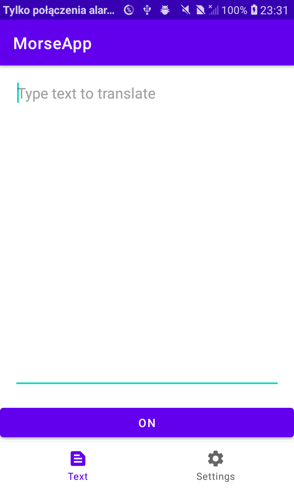
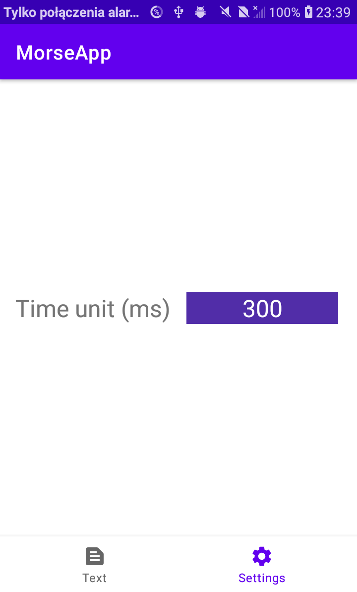

# MorseApp
Android app that translates english plain text into Morse code and shows it with flashlight.

Ideas for TODO:
- homepage, favourites, better dialog between fragments
- maybe vibration or sound as an addition to flashlight?

Some images of the app:

  

  

LANGUAGES:
* JAVA + ANDROID
   
CREDITS:
* Morse code translation API: https://github.com/PDymala/MorseCode
* Camera (flashlight) handling: https://github.com/natario1/CameraView
   
